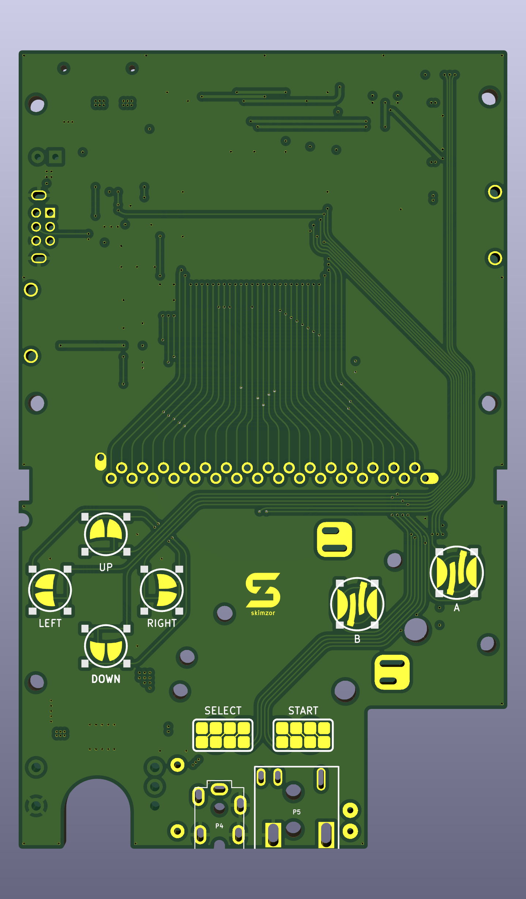

# SZ-MGB PCB

This is a replacement Game Boy Pocket (MGB) PCB with some additional features.  Using gekkio's reverse-engineered [MGB schematics](https://github.com/Gekkio/gb-schematics/tree/main/MGB-xCPU), I created a replacement MGB PCB in KiCad. 

# Features

- 4-Layer Board with GND and PWR Planes
- Customizable PCB Mask Color (through PCBWay)
- Conveniently-placed solder pads for aftermarket IPS screen kit controls
- Option for tactile buttons on the directional pad and A/B buttons

# Disclaimer
You will need to transfer components from a working Game Boy Pocket for this PCB to work.  Please do not attempt this project if you are inexperienced in soldering; populating this PCB will require desoldering and micro-soldering surface mount components.  You will also need to be able to read/understand the MGB schematics and be able to self-troubleshoot any issues.  I do not take responsibility or accept blame for any damage to your Game Boy or for any failed attempts. 

**Note**: There are multiple revisions of the OEM MGB PCBs.  These revisions have slight differences in passive components and their placement, but they *should* be compatible with this PCB.  Please be able to read/understand the MGB schematics to determine Game Boy revision and component compability with this PCB.

I have personally tested this PCB and successfully created a working Game Boy Pocket using components from an OEM revision **MGB-CPU-04** PCB. All features have been confirmed as working with the unit that I have created. ***However, I cannot guarantee a fully working unit if you undertake this project as there are too many factors that can cause issues, so please acknowledge this disclaimer and order/use this PCB at your own risk. Unless it is a PCB design issue, I will not be providing technical support for any issues you may have.***

# Ordering

This PCB will only be made available through PCBWay; gerbers/source files will not be released.  

You can order the board by clicking this PCBWay link ***(disclosure: I do receive a commission for each order placed)***.

If you want to support me and receive a $5 credit if you are a new PCBWay user, please consider using my [PCBWay Referral Link](https://www.pcbway.com/setinvite.aspx?inviteid=542484). 

Order with the following options:
- 1.0mm Thickness
- ENIG Surface Finish (HASL will oxidize over time and button conductivity will decrease)
- Any color solder mask

If you have suggestions to improve or identify issues with the PCB design, please contact me on discord: *skimzor#5078*.

# Bill of Materials & Assembly

As mentioned above in the disclaimer, assembly of this PCB requires advance soldering experience and ability to self-troubleshoot any issues.

Since this PCB follows the OEM MGB schematics, you are able to directly transplant components from a donor console to create a working MGB.  Components can also be ordered through an electronic components distributor (e.g. digikey, mouser, etc.) and can be found in the Bill of Materials (BOM) unless otherwise noted as required from the donor MGB (e.g. MGB CPU, RAM, Crystal, etc.). 

**Note:** Component placement on this PCB should roughly be in the same area as the OEM MGB; however, please verify orientation/polarity of components before soldering.

# Credit and Thanks

- [gekkio](https://gekkio.fi/) for their reverse-engineered MGB schematics, their CPU, RAM, Link Port [KiCad footprints](https://github.com/Gekkio/gekkio-kicad-libs) and overall contributions to the Game Boy community.
- [HDR](https://martinrefseth.com/) for compiling schematics, list of components, and board scans and their overall contributions to the Game Boy community.
- Krystalize for the [CGB board scans](https://nintenfo.github.io/repository/systems/GBC/documentation/schematics/).
- [Zekfoo](https://github.com/Zekfoo) for the inspiration for this project through their creation of the AGZ/CGZ/gbaHD-AIO.
- Various members of the Game Boy Discord community who helped troubleshoot/brainstorm ideas.

# License

 
 
This project/PCB is licensed under a Creative Commons Attribution-NonCommercial-ShareAlike 4.0 International License. ***Under this license, you are not permitted to profit from or commercialize this project.***
